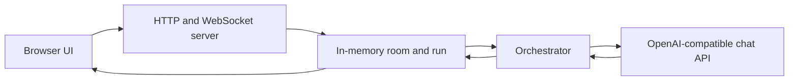

# AGORA

AGORA is Ritesh-Root’s open-source workspace where people and AI agents share tasks, chat, and one Markdown document. The session is drawn as a 3D office. When WebGPU and WebGL2 are both unavailable, the same session uses a 2D office.

This repository is a working local workspace, not a finished hosted product. A room lives in the memory of one server process. The current source includes a production process and host controls. No public deployment URL is recorded here.

## What you can do

Implemented in the current source:

- Join one shared room, up to five people, with a display name and a color. There are no accounts.
- Talk in the room. `@all` asks the team to discuss the idea. `@name` addresses one teammate. Chat does not start the document.
- The host submits a brief and starts the run with **Run Swarm**, then **Execute Swarm**.
- Watch planning, worker tasks, a debate when the run calls for one, and the assembled Markdown document.
- See the session in a 3D office (WebGPU, or WebGL2) or the 2D fallback.
- Save the document to your own machine as `agora-document.md`.
- Leave on your own, or, as host, end the session for everyone.
- Choose an OpenAI-compatible chat model in the browser, including a different model on an individual agent.
- Start the header’s benchmark control. That automated comparison is not a user study. See [Validation and performance](#validation-and-performance).

Not in this build: saved cloud rooms, accounts, spending caps, and host approval before a document edit becomes final. See [Roadmap](#roadmap).

## Quick start

The repository does not declare a Node.js version. The [Dockerfile](Dockerfile) uses Node 22. You need Node.js and npm.

```bash
npm install
npm run dev
```

`npm run dev` starts Vite on port 3000 and binds `0.0.0.0`. It also attaches the room relay. Open `http://localhost:3000`.

The first person to join is the host, unless `DEMO_HOST_SECRET` is set. With that variable set, only a matching host code, or the server-issued resume token, makes someone the host. A display name does not.

Model calls need a key:

- Save a key in the browser model settings. It stays in `localStorage` under `byok-config`.
- Or leave the browser key empty and set `DASHSCOPE_API_KEY` in the server environment. That server key is sent only to `token-plan.maas.qwencloudapi.com`. Any other endpoint needs the caller’s own key.

`.env.example` comments mention `QWEN_BASE_URL` and `QWEN_MODEL`. The server does not read those names. The selected model and base URL come from the browser settings.

Other scripts:

```bash
npm run build        # static client in dist/
npm run preview      # serves that static build only
npm run lint         # client typecheck
npm run lint:server  # server typecheck
npm test             # unit tests
```

`npm run preview` does not attach the room relay. Use `npm run dev`, or the production process in [Deployment](#deployment), when you want a room.

`./run-agora.sh` is an optional Chrome launcher for hardware WebGPU on Linux. The office runs without it.

## How a session works

1. People join the room. Everyone connected can see the brief, the tasks, the document, and public chat.
2. `@all` and `@name` send chat. The named agents can reply. That discussion does not create the document.
3. The host runs **Execute Swarm**. A second Execute while a run is active is refused with “A run is already in progress.”
4. Planning splits the brief into tasks. Workers run those tasks. An invalid worker output can be retried once.
5. Debate is conditional. With fewer than two usable worker outputs, there is no debate. Otherwise a conflict check runs. A skip does not debate. An ask-the-host result leaves a note. Any other result debates for up to two rounds, then the lead writes one Markdown document.
6. The default conflict check, used when `AGORA_DECIDER` is unset, takes that last path and debates whenever two usable outputs exist. `AGORA_DECIDER=jev` can skip, ask the host, or debate. Jev is a server-side decider. It is not a chat model and it does not write the document.
7. If the brief says “under 400 words,” the document may be at most 399 words. A word is a whitespace-separated span after trimming, and headings count. Up to two shortening passes may run. A draft that is still over the limit is kept and labelled “Needs revision: exceeds word limit.” If both the word limit and required sections fail, the word-limit label is the one shown. Repair calls are counted separately from the other model calls.
8. Section checks run only when the brief names problem, audience, priorities, and next steps. A miss is labelled “Needs revision: missing required sections.”
9. **Save a copy** downloads the Markdown. The room copy disappears when the process restarts.

**Leave room** drops only that person. **End session**, confirmed with **End for everyone**, is host-only. The server rejects anyone else with “Only the room host can end the session.” and does not wipe the room. A successful end stops scheduling, clears the room and the run, tells every client, and closes the sockets. A late model result cannot restore that document.

After you leave or the host ends the session, the page stays disconnected. An unexpected drop shows a reconnect screen. The separate **Watch a live run** control is an explicit local replay.

## System architecture



The browser shows the office, chat, task board, and document. In development, the Vite server attaches the relay and the `/api/cors-proxy` route. The production entry, [server/prod.ts](server/prod.ts), listens on `0.0.0.0` and `PORT` (8080 if unset), serves `dist/`, and attaches the same relay and proxy.

One process holds one room: roster, the last 100 public chat messages, cabin assignment, and a single run. Stages reported on that run are planning, working, debating, assembling, and repairing.

The orchestrator asks an OpenAI-compatible `/chat/completions` endpoint. The browser proxy forwards only an `https` URL whose path ends in `/chat/completions`, and only when the caller sends `Authorization`. It refuses private, loopback, and link-local targets, and it refuses redirects.

Nothing in this path writes the room to a database. Persistence across restarts is planned, not built.

## Model configuration

The default browser provider is Qwen Cloud’s Token Plan endpoint:

`https://token-plan.maas.qwencloudapi.com/compatible-mode/v1`

The default chat model is `deepseek-v4.1-flash`. The model list also includes `qwen3.8-max`, `qwen3.7-plus`, `qwen3.8-flash`, and `glm-5.3`. NVIDIA is a second provider, at `https://integrate.api.nvidia.com/v1`. AGORA is not limited to one vendor’s models. A saved base URL can point at another public HTTPS chat-completions endpoint when you supply that endpoint’s key.

Settings are stored in the browser under `byok-config`. An agent’s own model is sent with the run when it differs from the selected model. The header omits an agent model that matches the selection.

Key handling:

- A caller key is sent as-is and is never replaced by the server key.
- `DASHSCOPE_API_KEY` is used only when the caller key is empty and the host is `token-plan.maas.qwencloudapi.com`.
- Any other endpoint without a caller key fails with “Add an API key for that model endpoint.”
- The browser proxy copies the caller’s `Authorization` header and does not attach the server key.
- Provider failures shown in the room are short messages, such as “The API key was rejected.” or “That model is not available.” The provider body and the key are not shown.

Do not commit keys. `.env` is gitignored.

## Validation and performance

These are **reported local validation results** from clean commit `6983ddc` (“Keep a swarm document inside the brief and one active run per room.”). They are functional gate checks. They are not real-user benchmarks and they are not proof of usefulness. This README pass did not rerun them. Later commits, including the production entry and host controls, are not covered by this table.

| Check | Run | Recorded result |
|---|---|---|
| Consecutive film brief 1 | `0c4df963` | 258 words |
| Consecutive film brief 2 | `cef22a0f` | 349 words |
| Consecutive film brief 3 | `97163fb1` | 396 words; one repair |
| WebGL-disabled completion | `33b3584e` | 302 words; 2D fallback |
| Workers reload, first attempt | `6e0e9d8c` | State restored and duplicate Execute refused; model timed out after three HTTP attempts; no document |
| Workers reload, second attempt | `204d6509` | State restored; 1,136-word document on a brief without a word cap |
| Debate reload | `e23c0668` | Same run restored at a later stage; 378 words; 55.06 seconds; one repair |
| Assembly reload | `fae60359` | Same run restored; 1,490 words; 114.86 seconds; brief had no stated word cap |

For the debate-reload run, reported usage was 13 model calls: eight planning/worker/merge, four debate/other, one repair; 7,176 input tokens and 4,651 output tokens.

For the assembly-reload run, reported usage was 11 calls: seven planning/worker/merge and four debate/other; 13,239 input tokens and 13,573 output tokens.

How to read the numbers:

- A word is a whitespace-separated span, including headings. The current source still counts that way in [server/society/documentCheck.ts](server/society/documentCheck.ts).
- “Under 400 words” means at most 399.
- Up to two shortening passes are allowed.
- A draft still over the limit is preserved and labelled “Needs revision: exceeds word limit.”
- Repair usage is counted separately.
- The reload checks did not create a second run id.
- Cost was unavailable. It is not zero.
- The timings are single observations on different briefs and conditions. They are not averages and they are not a speed ranking.
- No controlled single-agent versus swarm comparison, and no independent user study, has been completed.
- Swarm Bench’s automated judge is not evidence that the workspace is useful to a person.

## Deployment

Verified from this repository:

- `npm run dev` serves the app and the room together.
- `npm run build` writes the client to `dist/`.
- `npm run preview` serves that client and does not start the room.
- [Dockerfile](Dockerfile) builds the client, bundles [server/prod.ts](server/prod.ts) to `dist/server.mjs`, and runs `node dist/server.mjs`.
- That process listens on `0.0.0.0` and `PORT`, default 8080, serves `dist/`, and attaches the relay.

No public demo URL is available. A container image and a Cloud Run service were not verified from this workspace. [`.github/workflows/deploy.yml`](.github/workflows/deploy.yml) builds a static `dist/` artifact for GitHub Pages. That workflow does not start the room process, so a Pages site would not be the shared room.

When every browser disconnects, the sockets close. With a platform that stops an idle process, the in-memory room is gone. A model call still in flight is not a background job. This repository does not promise that a document finishes after everyone leaves, or that it survives a restart.

## Current limitations and security

- One process, one room, at most five people.
- Everyone in the room can see the brief, the tasks, the document, and public chat.
- There are no accounts. Without `DEMO_HOST_SECRET`, the first joiner is the host. With it set, host authority is the host code or the resume token.
- Only the host can start a swarm, start a benchmark, or end the session.
- Room state is memory. A restart or an idle shutdown clears it. Save a copy if you want a file.
- There is no spending cap.
- A provider can reject a key, lack a model, or time out. The room shows a short error and does not echo the upstream body.
- Browser keys remain in `localStorage` on that origin.
- The server key must not be used against an arbitrary base URL. The proxy is not an open forwarder.
- Bundled 3D models are CC BY-NC 4.0. They are placeholders and are not licensed for commercial use. See [License and maintainer](#license-and-maintainer).

## Roadmap

No dates are set.

- Persist a cloud room across restarts, and keep an in-flight run when nobody is connected.
- Hold lasting document edits until the host accepts them.
- Replace the CC BY-NC office models before any commercial use.

## License and maintainer

Source code is MIT. See [LICENSE](LICENSE).

Third-party code and assets have their own notices. Those notices stay in the files the licenses require:

- [NOTICE.md](NOTICE.md) — MIT attribution for the upstream office shell, and the CC BY-NC terms for the bundled models.
- [LICENSE-ASSETS.md](LICENSE-ASSETS.md) — CC BY-NC 4.0 for the 3D assets, including the required credit to Arturo Paracuellos.
- [public/models/README.txt](public/models/README.txt) — the same asset terms, next to the model files.

Maintainer: Ritesh-Root &lt;workstationritalks@gmail.com&gt; · https://github.com/Ritesh-Root

Repository: https://github.com/Ritesh-Root/new-desgn-agora
